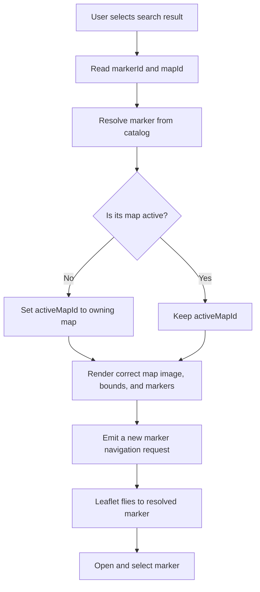
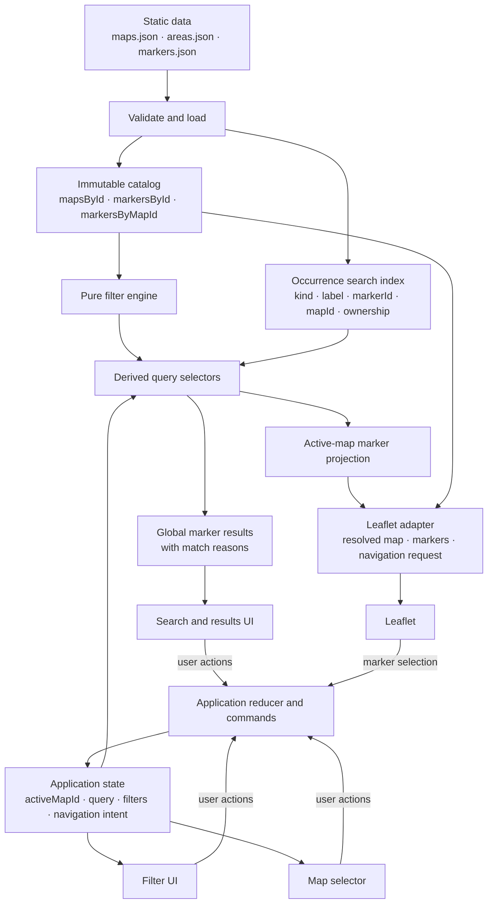

# Interactive Multi-Map Architecture

## Purpose

This document defines the target architecture for the Soul's Remnant
interactive map. It is an implementation guide, not a description of the
current component structure.

The design keeps the MVP proportional to the project: static JSON remains the
source of truth, rich entity data remains embedded in markers, React owns the
application UI, and Leaflet remains a rendering adapter. The additional
architecture is limited to the boundaries needed for multiple maps, global
search, structured filters, and reliable marker navigation.

## Design Goals

- Search every map without coupling search scope to the visible map.
- Add maps primarily through data and configuration.
- Keep search and filter rules pure and testable.
- Preserve the ownership path from a nested entity to its marker and map.
- Store only canonical user choices and navigation intent in application
  state.
- Give React and Leaflet resolved view data rather than raw business rules.
- Keep `src/data/markers.json` easy to maintain without prematurely
  normalizing monsters, items, drops, or interactables.

## Domain and Data Model

### Maps

`src/data/maps.json` is the source of available map display configurations. It
does not contain markers or game entities. Each map has a stable ID, a base
image, image dimensions, and, when maps require different behavior, viewport
configuration.

```ts
type MapId = string

type PercentagePoint = {
  x: number
  y: number
}

type GameMap = {
  id: MapId
  name: string
  imageUrl: string
  width: number
  height: number
  viewport?: {
    minZoom?: number
    maxZoom?: number
    focusZoom?: number
    panPadding?: number
    initialCenter?: PercentagePoint
    initialZoom?: number
  }
}
```

Image bounds are derived from `width` and `height`; Leaflet-specific bounds
types do not belong in the domain model. Viewport settings may remain shared
defaults until a map needs an override.

### Markers and map ownership

A marker represents a position. Every marker belongs to exactly one map
through `mapId`, and every `mapId` must resolve to an entry in `maps.json`.
Marker IDs must be globally unique across all maps so a `markerId` alone can be
resolved safely.

```ts
type MarkerId = string

type MapMarker = {
  id: MarkerId
  name: string
  mapId: MapId
  x: number
  y: number
  area?: string
  zoneType?: string
  level?: string
  monsters?: MarkerMonster[]
  resources?: MarkerResourceGroup[]
  warpPoint?: boolean
  wikiSlug?: string
  interactables?: MarkerInteractable[]
  tags?: string[]
}
```

Coordinates remain percentages from `0` to `100`, measured from the top-left
of the owning map. The Leaflet adapter converts them using that map's
dimensions.

Rich monster, drop, resource, item, and interactable data remains embedded in
the marker for the MVP. A derived search index may normalize access to those
values, but it does not become a second editable source of truth.

### Runtime catalog

At startup, static data is validated and projected into an immutable catalog:

```ts
type GameCatalog = {
  maps: readonly GameMap[]
  markers: readonly MapMarker[]
  mapsById: ReadonlyMap<MapId, GameMap>
  markersById: ReadonlyMap<MarkerId, MapMarker>
  markersByMapId: ReadonlyMap<MapId, readonly MapMarker[]>
}
```

The lookup maps are derived indexes. They improve ownership resolution and
avoid repeated linear searches, but are not application state or additional
data files.

## Multi-Map Application Model

`activeMapId` identifies the map currently displayed by the map renderer. It
does not define the search scope.

The application derives the active map from the catalog:

```ts
const activeMap = catalog.mapsById.get(state.activeMapId)
```

Changing `activeMapId` changes the base image, bounds, viewport configuration,
and rendered marker subset. Search results remain global. Filters also remain
active unless the user explicitly clears them.

Map selection is navigation state, not a filter. If a future feature allows
users to limit search to chosen maps, that must be represented as a separate,
explicit filter such as `searchMapIds`; it must not reuse `activeMapId`.

Adding a map should normally require:

1. adding one entry to `maps.json`;
2. adding its image under `public/maps/`;
3. adding markers whose `mapId` references the new map;
4. optionally overriding viewport configuration.

No map ID should be hardcoded in layout, search, filter, or Leaflet
components.

## Search Architecture

### Global search scope

The search index is built from every marker in `markers.json`, regardless of
`activeMapId`. A query therefore discovers markers and nested entities across
all maps.

The MVP should continue using normalized case-insensitive substring matching
with deterministic exact, prefix, and partial ranking. Fuzzy-search libraries
are unnecessary until real usage demonstrates a need.

### Occurrence-level search documents

The index should preserve each searchable occurrence instead of merging away
its ownership context.

```ts
type SearchDocumentKind =
  | 'marker'
  | 'area'
  | 'zoneType'
  | 'level'
  | 'tag'
  | 'monster'
  | 'monsterDrop'
  | 'resourceType'
  | 'resourceItem'
  | 'interactable'

type SearchDocument = {
  id: string
  kind: SearchDocumentKind
  label: string
  normalizedText: string
  aliases: readonly string[]
  markerId: MarkerId
  mapId: MapId
  context: {
    markerName: string
    area?: string
    parentLabel?: string
    breadcrumb: readonly string[]
  }
  source: {
    field: string
    path: readonly (string | number)[]
  }
}
```

For example, a `Kunai` drop document retains the path:

```text
Kunai
  -> owning monster
  -> owning marker
  -> owning map
```

The UI does not need to inspect `marker.monsters[].drops[]` to reconstruct
that relationship.

### Suggestions and results

Autocomplete suggestions and navigable search results serve different roles:

- A suggestion may group equal labels of the same kind across several marker
  occurrences. Selecting an ambiguous grouped suggestion commits its label as
  the query and shows all matching marker results; it must not choose an
  arbitrary location.
- A concrete search result is marker-centric and contains its matching search
  documents. It always resolves to a `markerId` and `mapId`, and is therefore
  navigable.

```ts
type SearchHit = {
  documentId: string
  kind: SearchDocumentKind
  label: string
  markerId: MarkerId
  mapId: MapId
  breadcrumb: readonly string[]
  matchedText: string
  rank: number
}

type MarkerSearchResult = {
  markerId: MarkerId
  mapId: MapId
  matches: readonly SearchHit[]
  rank: number
}
```

Results are deduplicated by marker while retaining all relevant match reasons.
This allows a result to explain that a marker matched because a particular
monster drops `Kunai`, for example.

Plain text results and autocomplete must use the same field projection and
normalization rules. Context used only for ranking or display must be marked as
such so selecting a suggestion cannot produce surprising result semantics.

## Filter Architecture

Filters are structured constraints over markers. Their definitions and
matching functions belong in the domain/query layer, not in React components.

```ts
type FacetSelection<T extends string> =
  | null
  | readonly T[]

type NumericRange = {
  minimum?: number
  maximum?: number
}

type MarkerFilters = {
  areas: FacetSelection<string>
  categories: FacetSelection<string>
  tags: FacetSelection<string>
  markerLevel?: NumericRange
  monsters: {
    names: FacetSelection<string>
    level?: NumericRange
    drops: FacetSelection<string>
  }
  resources: {
    types: FacetSelection<string>
    items: FacetSelection<string>
  }
  interactables: FacetSelection<string>
}
```

`null` means unrestricted. An empty array means the user deliberately selected
no values and therefore matches no markers for that facet. This distinction
supports both a normal "Reset filters" action and the current "Clear all"
checkbox behavior.

Filter semantics are:

- values within one facet are ORed;
- different active facets are ANDed;
- filters with no active constraint do not affect the result;
- nested constraints preserve their parent relationship.

For example, filtering by a monster and one of its drops should require one
monster occurrence to satisfy both constraints. It should not match a marker
where the named monster exists but the drop belongs to a different monster.
Resource type and resource item constraints should similarly be evaluated
against the same resource group.

The public boundary remains small and pure:

```ts
function matchesMarkerFilters(
  marker: MapMarker,
  filters: MarkerFilters,
): boolean

function queryMarkers(
  catalog: GameCatalog,
  searchIndex: SearchIndex,
  input: {
    query: string
    filters: MarkerFilters
  },
): readonly MarkerSearchResult[]

function selectRenderedMarkers(
  catalog: GameCatalog,
  results: readonly MarkerSearchResult[],
  activeMapId: MapId,
): readonly MapMarker[]
```

Filter-option lists and result counts are derived from the catalog and current
query state. They are not stored separately.

## Search and Filter Semantics

Search and filters form an intersection over the global marker collection.
`activeMapId` is applied only after that global result set is known.

```text
all markers
    -> structured filters
    -> text/entity search
    -> global marker results with match reasons
    -> active-map projection
    -> rendered markers
```

Applying filters before search is a useful implementation optimization, not a
different product rule; logically both are predicates over the same global
collection.

| State | Global result list | Rendered markers |
| --- | --- | --- |
| No query, unrestricted filters | All markers | All markers on the active map |
| Query only | All matching markers across maps | Matching markers on the active map |
| Filters only | All filtered markers across maps | Filtered markers on the active map |
| Query and filters | Their global intersection | Active-map subset of the intersection |
| Active map changes | Unchanged | Reprojected onto the new active map |
| Search clears | Filters remain | Filtered markers on the active map |
| Filters reset | Search remains | Search matches on the active map |

Autocomplete remains global even when filters are active. It may display the
number of targets allowed by current filters, but it must not silently hide all
knowledge of entities outside that filter scope. Selecting a suggestion does
not implicitly change filters.

## Canonical and Derived State

Application state contains user choices and repeatable navigation intent:

```ts
type MarkerNavigationIntent = {
  markerId: MarkerId
  mapId: MapId
  requestId: number
}

type MapApplicationState = {
  activeMapId: MapId
  searchQuery: string
  filters: MarkerFilters
  markerNavigation: MarkerNavigationIntent | null
}
```

`requestId` changes for every navigation request, including repeated requests
for the same marker. The selected marker identity is derived from the current
navigation intent rather than stored as a second independent value.

| Value | Classification |
| --- | --- |
| JSON map, marker, and area records | Canonical static data |
| `activeMapId` | Canonical application state |
| `searchQuery` | Canonical application state |
| `filters` | Canonical application state |
| marker navigation intent | Canonical, short-lived application intent |
| active map object | Derived from `activeMapId` |
| selected marker object/ID | Derived from navigation intent and catalog |
| search index | Derived immutable index |
| global search results | Derived |
| filter options and counts | Derived |
| active-map/rendered markers | Derived |
| autocomplete open state and active row | Component-local UI state |
| mobile drawer state | Component-local UI state |
| Leaflet pan, zoom, and animation state | Leaflet-adapter state |

Collections such as `filteredMarkers`, `visibleMarkers`, and `searchResults`
must not become independently synchronized application state.

Normal search or filter editing should clear marker selection/navigation so a
hidden selection cannot remain dormant and unexpectedly return later. Manual
map selection preserves search and filters but clears a selection from another
map. A concrete result selection creates a new navigation intent atomically.

## Marker Selection and Cross-Map Navigation

All marker navigation goes through one application command. Leaflet marker
clicks, result clicks, and future direct links use the same boundary.

```ts
function navigateToMarker(markerId: MarkerId): void
```

The command resolves the marker from `markersById`, obtains its owning
`mapId`, switches `activeMapId` when necessary, and emits a new navigation
request. Unknown IDs fail safely before reaching Leaflet.

The map adapter receives the resolved map, already projected markers, the
resolved target marker, and the navigation request ID. It watches the request
ID rather than only the marker ID, so selecting the same marker repeatedly can
recenter the map and reopen its details.



Switching maps and creating the navigation request must be one intentional
application transition. The adapter may wait until the destination map has
mounted, but it must not rediscover ownership by scanning raw data.

## Layer Boundaries

### Data and domain

Own static schemas, IDs, coordinates, embedded entity contracts, and data
validation. This layer has no React or Leaflet imports.

### Catalog, search, filters, and selectors

Own immutable lookup indexes, search projection, ranking, filter predicates,
match provenance, and derived marker collections. Functions should be pure
where possible and accept their data explicitly rather than importing UI
state.

### Application state

Own `activeMapId`, query, filters, and navigation transitions. A local React
`useReducer` or a focused `useMapApplication` hook is sufficient. An external
state-management library is not justified.

### React UI

Render map selection, search, filters, results, and details. Components receive
view models and dispatch user actions. They do not traverse nested marker data
to implement search or filter rules.

### Leaflet adapter

Own conversion from percentage coordinates to Leaflet coordinates, map
container lifecycle, image overlays, markers, popups, and pan/zoom commands.
It receives one resolved `GameMap`, already projected markers, and an explicit
navigation request. It does not import all maps or markers and does not own
search/filter logic.

For reliable per-map bounds and initialization, the initial implementation may
key the Leaflet map container by `activeMapId`. Remembering separate viewports
per map can be added later if users need it.

## Expected Data Flow



An example nested search flow is:

```text
query "Kunai"
  -> search document for a monster drop
  -> search hit with monster breadcrumb
  -> marker-centric global result
  -> markerId + mapId
  -> navigation command
  -> active map and focus request
  -> Leaflet adapter
```

## Suggested Module Boundaries

The exact file migration can be incremental, but responsibilities should move
toward:

```text
src/
  data/
    maps.json
    areas.json
    markers.json
    catalog.ts
    validate-data.ts
  domain/
    map.ts
    marker.ts
    search.ts
    filters.ts
    navigation.ts
  query/
    build-search-index.ts
    search-markers.ts
    filter-markers.ts
    filter-options.ts
    selectors.ts
  application/
    map-state.ts
    map-reducer.ts
    use-map-application.ts
  components/
    maps/
    map/
    search/
    filters/
    layout/
```

This does not require creating every file immediately. A file should be split
only when the corresponding responsibility is implemented.

## Performance Approach

The current dataset does not justify a backend, worker, fuzzy-search library,
or elaborate cache.

- Build the catalog and search index once from static data.
- Pre-normalize search-document text.
- Use `markersById` for navigation and `markersByMapId` for map projection.
- Memoize derived selectors using stable catalog and state inputs.
- Pass only active-map markers into Leaflet.
- Keep marker component keys and icon definitions stable.
- Measure query latency and visible marker count before introducing more
  advanced indexing, clustering, canvas rendering, or virtualization.

The search index is a necessary read model because it preserves nested
ownership and match reasons. It is not a premature cache layer.

## Architecture Invariants

The implementation must preserve these rules:

1. Global search uses markers from every configured map and never depends on
   `activeMapId`.
2. `activeMapId` controls which map image, bounds, configuration, and marker
   subset Leaflet renders.
3. Choosing the active map is navigation state and must not accidentally act
   as a global-search filter.
4. Every marker belongs to exactly one valid map through `mapId`.
5. Marker IDs are globally unique, and a marker lookup deterministically
   resolves its owning map.
6. Every concrete search result exposes both `markerId` and `mapId`.
7. Nested search documents preserve enough context to resolve the owning
   marker, map, and immediate parent such as a monster or resource group.
8. Search and structured filters combine as an intersection over the global
   marker collection.
9. Values within a facet use OR semantics; independent facets use AND
   semantics; related nested constraints preserve their parent relationship.
10. Leaflet owns rendering, coordinate adaptation, popups, and viewport
    commands. It does not own search, filtering, ownership resolution, or
    application navigation rules.
11. Search, filter, catalog, and selector logic remains independent of React
    and Leaflet and is pure and testable where possible.
12. Filtered markers, global results, active-map markers, filter options, and
    selected marker objects are derived values, not duplicated application
    state.
13. Selecting the same marker more than once creates a new navigation request
    and remains capable of recentering and reopening that marker.
14. Cross-map navigation switches to the owning map before attempting to focus
    or open its marker.
15. Filters do not change implicitly when a search suggestion or result is
    selected.
16. Adding another map is primarily a map configuration, image, and marker-data
    change; shared UI and business logic must not require a new hardcoded map
    branch.
17. `markers.json` remains the editable runtime source of marker and embedded
    entity data. Derived indexes never become competing sources of truth.
18. Official game names, wiki slugs, image paths, and URLs retain their
    canonical spelling.

## Deferred and Unresolved Decisions

The following decisions do not block the architecture, but should be made
before the corresponding implementation work is planned:

- **Area identity:** area names work today. Stable area IDs should be evaluated
  before different maps contain areas with equal display names or before area
  names become URL state.
- **Marker categories:** the project needs a small explicit category vocabulary
  before category filters are implemented. It should not infer every category
  permanently from arbitrary nested content.
- **Level representation:** current marker levels are strings and may contain
  ranges. Numeric level filtering requires a documented parsed representation
  or explicit minimum/maximum fields. Monster-level filtering also requires a
  structured monster level field, which does not exist yet.
- **Item classification:** the current `Essence` classification is inferred
  from its name. Decide whether it remains presentation-only or becomes
  explicit structured item metadata before expanding item-category filters.
- **URL state:** active map, query, non-default filters, and selected marker are
  suitable for future serialization, but URL format and browser-history rules
  should be designed after the application-state transitions are stable.

These questions should be resolved with concrete data and UI requirements.
They do not justify a backend, entity normalization, generic filter framework,
or external state library now.
